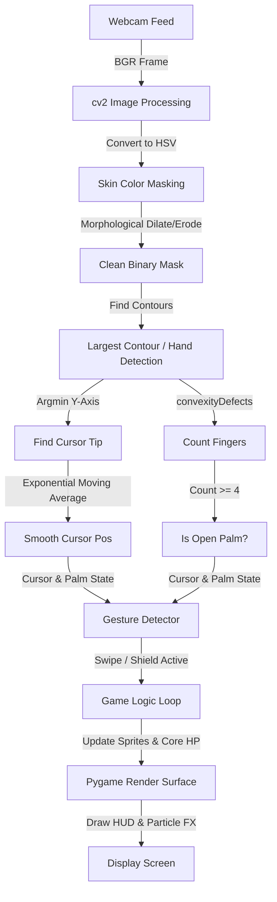

# 🦠 Virus Swat - Gesture Controlled Arcade Game

[](https://www.python.org/downloads/)
[](https://pyga.me/)
[](https://opencv.org/)
[](https://opensource.org/licenses/MIT)

**Virus Swat** is a fast-paced, cyberpunk-themed arcade game where you defend a central core from incoming viral infections—using nothing but your hand gestures. Powered by real-time computer vision (OpenCV) and Pygame-ce, it tracks your movements via webcam, turning real-world swipes and hand shapes into in-game actions without needing specialized tracking hardware or bloated AI frameworks.

---

## 📖 About the Project

This project was built to explore the integration of computer vision with high-performance game loops. Unlike standard computer vision games that rely on resource-heavy machine learning frameworks like MediaPipe, **Virus Swat** implements a lightweight skin-segmentation and contour-defect algorithm using OpenCV and NumPy. This keeps the CPU overhead minimal, rendering a smooth 60 FPS gameplay experience on modern systems.

---

## 🛠️ How It Works (Architecture)

The game runs on a loop that captures camera frames, analyzes hand geometry, updates game states, and renders visual outputs:



### 👁️ Computer Vision Pipeline

1. **Skin Segmentation:** The BGR webcam frame is converted to the **HSV** color space. A skin-tone thresholding mask is applied (`H: [0, 20], S: [20, 255], V: [70, 255]`) to isolate hand regions.
2. **Noise Reduction:** Dilate and erode morphological filters remove background speckles, followed by a Gaussian Blur to smooth out edges.
3. **Contour Extraction:** The engine extracts contours from the binary mask and targets the largest contour above a threshold area to find the hand.
4. **Fingertip Tracking:** The topmost point of the hand contour serves as the cursor pointer.
5. **EMA Smoothing:** An exponential moving average (EMA) with $\alpha = 0.4$ smooths the cursor coordinate to prevent jitter:
   $$x_{smooth} = \alpha \cdot x_{raw} + (1 - \alpha) \cdot x_{prev}$$
6. **Convexity Defects:** The convex hull of the hand contour is calculated, and convexity defects (inward folds between fingers) are measured. A finger is counted if the angle between the defect's start, far, and end points is $\le 90^{\circ}$ and the depth is sufficient. If finger count is $\ge 4$, an **open palm** is detected.

---

## 🚀 Features

- **✋ Gesture-Based Controls:** No keyboard or mouse required. Swat viruses with a swipe or deploy a digital shield with an open palm.
- **🌃 Cyberpunk Aesthetic:** Custom neon visual designs, techy grid backgrounds, and a pulsing core.
- **📈 Dynamic Difficulty:** Virus spawn rates and types scale dynamically with your score.
- **💥 Visual Effects:** Screen-shake/flash upon taking damage, particle explosion mechanics on kill, and a cursor trail.
- **🦠 Distinct Virus Types:**
  - **Normal:** Standard green virus, moderate speed.
  - **Fast:** Cyan virus, moves rapidly.
  - **Tank:** Hardened red virus, requires 3 hits to destroy.
  - **Split:** Purple virus that splits into two hyper-fast **Mini** clones upon destruction.

---

## 🎮 How to Play

### Gestures and Controls
| In-Game Action | Gesture Requirement |
| :--- | :--- |
| **Start / Restart** | Perform a fast swipe across the screen |
| **Swat Virus** | Swipe cursor through a virus |
| **Shield Core** | Hold **palm open** (fingers spread) when the power meter (bottom purple bar) is full |
| **Quit Game** | Press the `ESC` key on your keyboard |

### Objectives
1. **Protect the Core:** Prevent viruses from colliding with the central blue core.
2. **Build Combos:** Destroying multiple viruses in quick succession builds your combo multiplier. The combo resets if you take damage or go 2 seconds without a kill.
3. **Manage Energy:** Destroying viruses charges your purple energy meter. Once full, use the open-palm gesture to trigger a temporary invulnerability shield.

---

## 📂 Project Structure

- `main.py`: Entry point that coordinates the video capture, hand tracking, logic, and frame rendering.
- `hand_tracking.py`: Implements skin segmentation, contour tracking, fingertip lookup, and finger counting.
- `gesture_detection.py`: Tracks frame-to-frame velocity to identify swipes and checks shield activation duration.
- `game_logic.py`: Manages scores, virus spawning, split-virus clones, collisions, and particle lists.
- `virus.py`: Class definition for individual virus sprites, speed, HP, and neon drawing methods.
- `ui.py`: Renders the cyberpunk menus, HUD, game-over screens, and cursor trail.

---

## 🔧 Installation & Setup

### Prerequisites
- Python 3.8 or higher installed on your computer.
- A webcam connected to your system.

### 1. Clone the Repository
```bash
git clone https://github.com/madhusatyakumarkatta/virus_swatgame.git
cd virus_swatgame
```

### 2. Install Dependencies
Install the required packages using `pip`:
```bash
pip install -r requirements.txt
```

### 3. Run the Game
Execute the main script to start playing:
```bash
python main.py
```
*Note: A secondary window titled "Hand Tracking Debug" will run alongside the main window. This helps you calibrate skin-masking in different lighting environments.*

---

## 📜 License

This project is licensed under the MIT License - see the [LICENSE](LICENSE) file for details.

*Created as a Semester 1 Project.*
